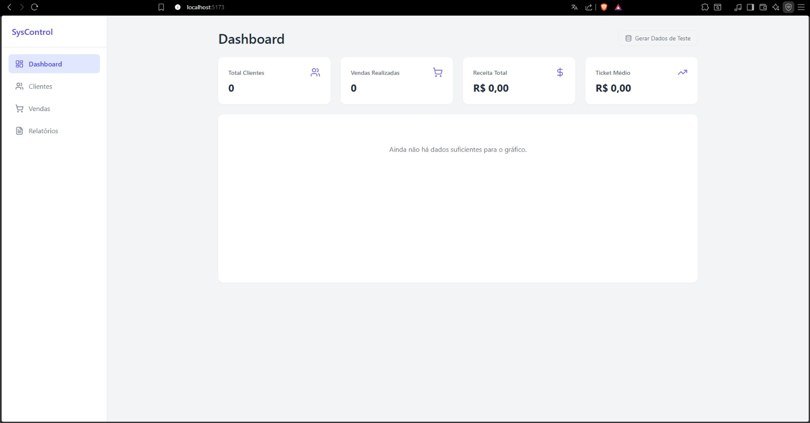
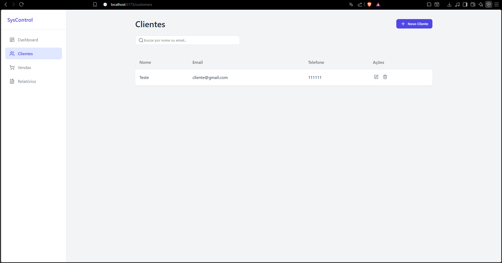
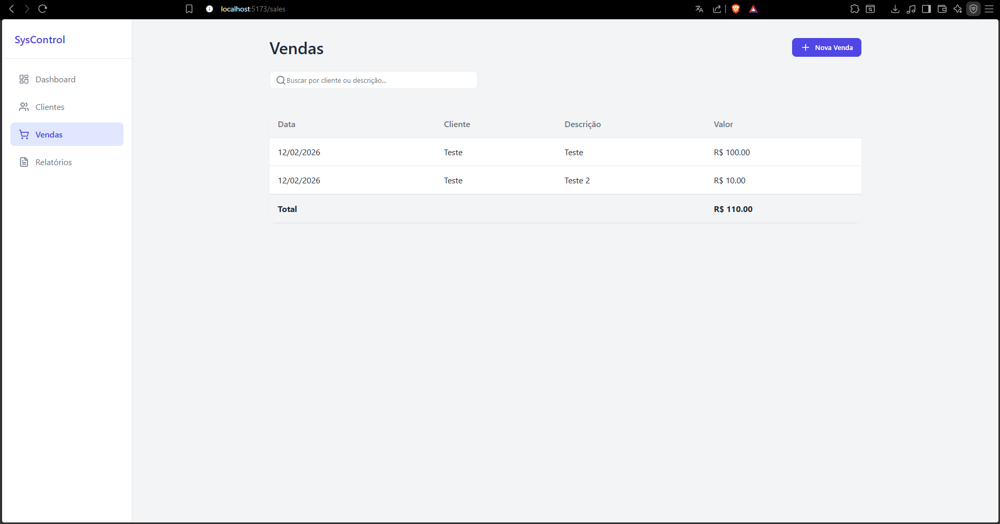

## Client & Sales Management System

  
  
  

---

## Overview

A modern web-based management system built to help small businesses organize clients, track sales, and monitor performance metrics through a clean and responsive dashboard.

Designed with scalability, usability, and performance in mind.

---

## 🖼 Project Preview

### 📊 Dashboard

### 👥 Client Management

### 💰 Sales Tracking

---

## Features

- ✅ Client registration & management (CRUD)
- ✅ Sales tracking system
- ✅ Performance dashboard with analytics
- ✅ Responsive interface
- ✅ Clean and modular architecture
- ✅ Optimized state management

---

## 🛠 Tech Stack

- React
- Vite
- JavaScript (ES6+)
- CSS
- ESLint

---
